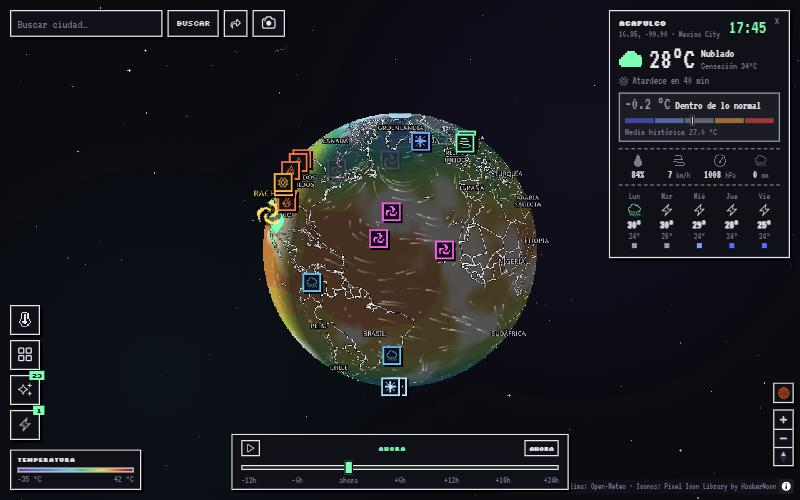
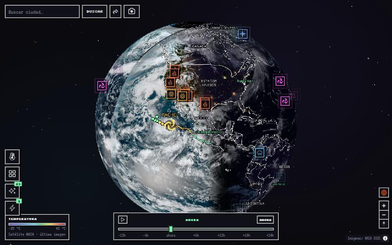
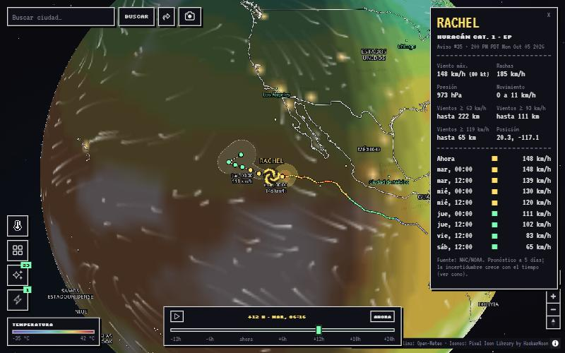
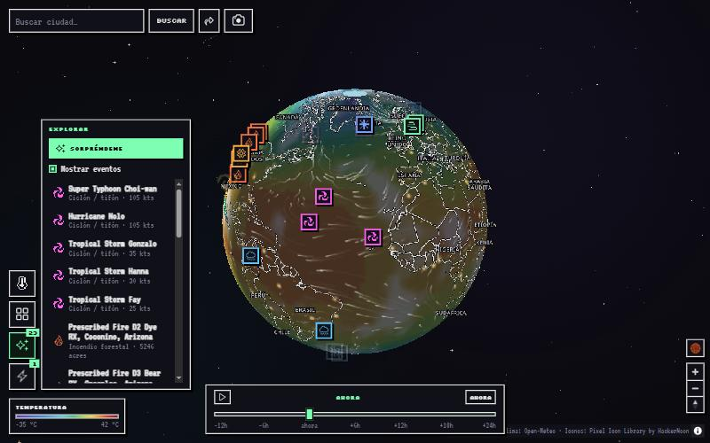
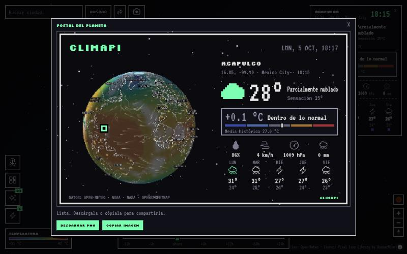
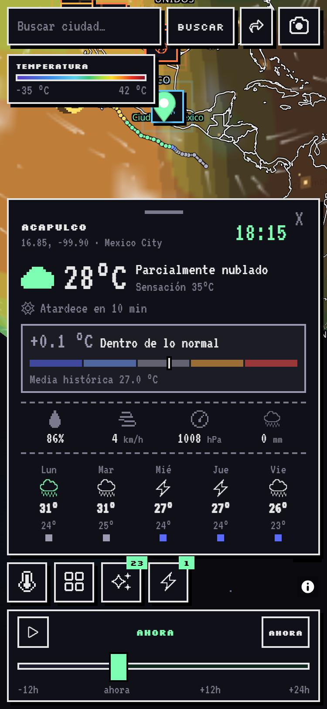
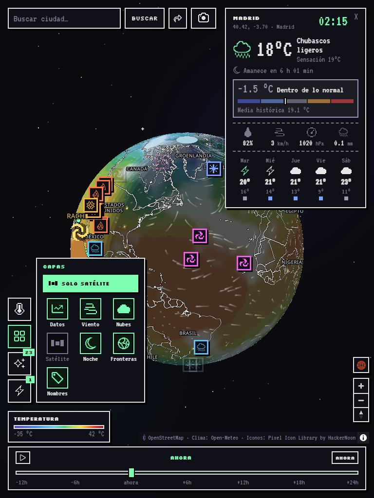

<p align="center">
  
</p>

<h1 align="center">Climapi</h1>

<p align="center">
  Globo terráqueo interactivo con clima en tiempo real, estética pixel art oscura y minimalista.<br>
  Sitio estático: no necesita compilar ni instalar dependencias.
</p>

<p align="center">
  
</p>

## Qué hace

- **Globo 3D** (MapLibre GL JS con proyección `globe`) con búsqueda de ciudades y clima al hacer clic.
- **Ocho datos en el mapa**: temperatura, precipitación, viento, nubosidad, humedad, presión, nieve e índice UV, con leyenda.
- **Línea de tiempo** de −12 h a +24 h que mueve datos, iluminación día/noche, nubes, viento, tormentas y satélite.
- **Satélite real** (NASA GIBS): mosaico diario VIIRS y geoestacionarias GOES/Himawari casi en vivo.
- **Tormentas y huracanes** (NHC/NOAA): trayectoria pasada y pronosticada, cono, radios de viento, intensidad y mayor acercamiento a un lugar.
- **Explorar**: eventos reales del planeta (NASA EONET: incendios, volcanes, ciclones…) y récords del día (calor, frío, viento, lluvia).
- **¿Es normal?**: en el panel de clima, la anomalía de temperatura frente a las mismas fechas de los últimos 10 años (ERA5), con un punto de color por cada día del pronóstico.
- **Capas extra**: nubes animadas, partículas de viento, luces de ciudades, fronteras y nombres.
- **Adaptable**: escritorio, tablet, móvil vertical y móvil horizontal, con zonas táctiles amplias y modo ligero en móviles.
- **Compartir vista**: todo el estado se guarda en la URL.
- **Postal compartible**: una imagen PNG pixel art (1200×720) con el globo tal como lo ves y la ficha del lugar abierto o un resumen "El planeta hoy". Se descarga, se copia o se comparte desde el móvil.

## Capturas

### Satélite real
Imágenes de la NASA (GIBS) bajo todas las capas: el mosaico diario VIIRS más GOES/Himawari casi en vivo, con la línea de tiempo
para ver hasta 12 h atrás. De noche se distinguen las luces de las ciudades.

<p align="center">
  
</p>

### Tormentas y huracanes, y la máquina del tiempo
Trayectoria pasada y pronosticada del NHC, intensidad y radios de viento. Al mover la línea de tiempo (aquí, +12 h) las tormentas
recorren su trayectoria y cambian de categoría; el panel muestra la tarjeta de la tormenta.

<p align="center">
  
</p>

### Explorar
Eventos reales del planeta (incendios, ciclones, volcanes, icebergs) y los récords del día. Un clic en la lista, o en
"Sorpréndeme", vuela hasta el evento y abre el clima del lugar.

<p align="center">
  
</p>

### Postal compartible
Una imagen PNG pixel art con el globo tal como lo ves, la ficha del lugar con su anomalía ("¿es normal?") y el pronóstico.

<p align="center">
  
</p>

### Móvil y tablet
El dock pasa a una fila horizontal y el panel de clima a una hoja inferior plegable (móvil), o se mantiene el diseño de
escritorio con la línea de tiempo a ancho completo (tablet).

<p align="center">
  
  &nbsp;&nbsp;
  
</p>

## Ejecutar

Hace falta servir la carpeta por HTTP (abrir `index.html` con doble clic no funciona por las peticiones a las APIs):

```bash
python tools/serve.py          # http://localhost:8080
python tools/serve.py 9000     # otro puerto
```

El servidor no usa caché, así que los cambios se ven al recargar. Alternativas equivalentes:
`npx serve .` o la extensión *Live Server* de VS Code.

## Estructura

```
Climapi/
├─ index.html              Estructura de la página y orden de carga de los scripts
├─ manifest.webmanifest    Instalación en la pantalla de inicio (móviles)
├─ assets/
│  └─ img/                 Logo e icono de la app (veleta.png)
├─ docs/
│  └─ img/                 Capturas del README
├─ src/
│  ├─ css/                 Estilos por componente
│  │  ├─ base.css            Variables, tipografías, reinicio y "bloque pixel"
│  │  ├─ icons.css           Iconos pixel (máscara)
│  │  ├─ map-ui.css          Buscador, ayuda, avisos y controles de MapLibre
│  │  ├─ panel.css           Panel de clima, alertas y tarjeta de tormenta
│  │  ├─ dock.css            Dock de capas, paneles desplegables y leyenda
│  │  ├─ timeline.css        Línea de tiempo
│  │  ├─ explore.css         Modo Explorar
│  │  ├─ storms.css          Lista y marcador de tormentas
│  │  ├─ anomaly.css         Anomalía de temperatura del panel
│  │  ├─ postcard.css        Ventana de la postal compartible
│  │  └─ responsive.css      Todos los @media: tablet, móvil vertical y horizontal, táctil
│  └─ js/
│     ├─ core/               Arranque y estado
│     │  ├─ device.js          Detección táctil y "modo ligero" (cargar el primero)
│     │  ├─ app.js             Mapa, panel de clima y buscador
│     │  └─ share.js           Compartir vista (estado en la URL)
│     ├─ data/
│     │  └─ cities.js          Lista de ciudades principales
│     ├─ layers/             Capas del mapa
│     │  ├─ weather.js         Mapa de color (8 datos), viento y selector de dato
│     │  ├─ clouds.js          Nubes animadas (ruido 3D)
│     │  ├─ daynight.js        Terminador día/noche y luces de ciudades
│     │  ├─ satellite.js       Imágenes de satélite (NASA GIBS)
│     │  └─ borders.js         Fronteras y nombres de países y ciudades
│     ├─ features/           Funciones con datos propios
│     │  ├─ storms.js          Tormentas y huracanes (NHC)
│     │  ├─ explore.js         Eventos del planeta y récords del día
│     │  ├─ anomaly.js         "¿Es normal?": anomalía frente al histórico
│     │  └─ postcard.js        Postal compartible (PNG generado en un canvas)
│     ├─ ui/                 Interfaz
│     │  ├─ icons.js           Iconos pixel
│     │  ├─ dock.js            Apertura/cierre de los paneles del dock
│     │  ├─ mobile.js          Móvil: hoja plegable, altura de la línea de tiempo y encuadre del mapa
│     │  └─ timeline.js        Control de la línea de tiempo
│     └─ effects/
│        └─ space.js           Estrellas, nebulosas y estrellas fugaces
└─ tools/
   └─ serve.py             Servidor local sin caché
```

## Notas de desarrollo

- **Sin compilación.** Los scripts son clásicos (no módulos) y se comunican mediante globales (`window.*`),
  por eso **el orden de `<script>` en `index.html` importa**: `data/cities.js` antes de las capas que lo usan,
  `ui/icons.js` antes de quien dibuja iconos y `core/app.js` al final.
- **Móviles y tablets.** Todos los `@media` están en `src/css/responsive.css` (≤1000 px tablet, ≤700 px móvil vertical,
  alto ≤520 px móvil horizontal, `pointer: coarse` táctil). En móvil el dock pasa a horizontal, el panel de clima es una
  hoja inferior que se pliega tocando su cabecera, y el mapa se encuadra en el espacio libre. Los apilados usan la altura
  real de la línea de tiempo (`--tl-h`, medida por `ui/mobile.js`) y las áreas seguras (`env(safe-area-inset-*)`).
- **Modo ligero.** `core/device.js` lo activa en pantallas táctiles o equipos modestos: menos partículas de viento, nubes y
  estrellas más ligeras, mapa de color de menor resolución y densidad de píxeles limitada a 2×. Fuerza con `?lite=1` o `?lite=0`.
  Es instalable en la pantalla de inicio (`manifest.webmanifest`); aún no hay *service worker*, así que no funciona sin conexión.
- **Caché del navegador.** Los enlaces locales llevan `?v=N`. Si cambias un archivo y no ves el cambio, sube el número.
- **Postal.** El mapa se crea con `preserveDrawingBuffer` para poder capturar el lienzo WebGL. Copiar la imagen al
  portapapeles requiere HTTPS o `localhost`. Los marcadores HTML (remolinos de tormenta, eventos) no están en el lienzo,
  así que no salen en la postal; sí las capas, las trayectorias y el satélite.
- **Enlaces compartidos.** El estado va en el hash: `#c=lng,lat&z=zoom&m=dato&t=segundos&l=-capa,+capa&p=lat,lon`.
- **Límites de las APIs gratuitas.** Open-Meteo admite unas 600 llamadas por minuto; cada carga consume cerca de 400.
  Los datos de la rejilla se guardan 1 hora en `localStorage`. Recargar muchas veces seguidas devuelve error 429.
- **Publicar.** Es un sitio estático: basta subir la carpeta a GitHub Pages, Netlify o similar.
  Antes conviene sustituir las teselas públicas de OpenStreetMap por un proveedor propio si habrá mucho tráfico.

## Fuentes de datos y créditos

| Qué | Fuente | Licencia / condiciones |
|---|---|---|
| Clima y previsión | [Open-Meteo](https://open-meteo.com) | CC BY 4.0 (uso no comercial gratuito) |
| Histórico (anomalías) | [Open-Meteo Archive](https://open-meteo.com/en/docs/historical-weather-api), reanálisis ERA5 de Copernicus/ECMWF | CC BY 4.0 |
| Tormentas | [NHC / NOAA](https://www.nhc.noaa.gov) | Dominio público (EE. UU.) |
| Eventos naturales | [NASA EONET](https://eonet.gsfc.nasa.gov) | Datos abiertos NASA |
| Imágenes de satélite | [NASA GIBS](https://earthdata.nasa.gov/gibs) | Datos abiertos NASA |
| Mapa base | © [OpenStreetMap](https://www.openstreetmap.org/copyright) | ODbL |
| Fronteras | [Natural Earth](https://www.naturalearthdata.com) vía jsDelivr | Dominio público |
| Mapa 3D | [MapLibre GL JS](https://maplibre.org) | BSD-3-Clause |
| Iconos | [Pixel Icon Library](https://pixeliconlibrary.com) de HackerNoon | CC BY 4.0 (requiere atribución) |
| Tipografías | Silkscreen y VT323 (Google Fonts) | SIL Open Font License |
